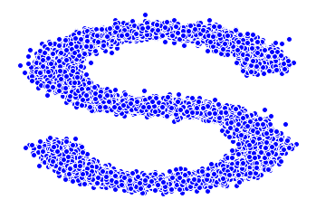
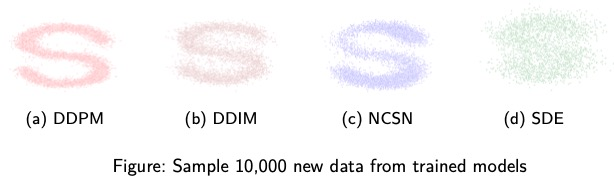

# Diffusion Models on Dataset *make_s_curve*

This project implements 4 diffusion models DDPM, DDIM, NCSN and SDE on the dataset *make_s_curve*.

## Main Dependencies

- numpy
- matplotlib
- torch
- sklearn

## Datasets

The project uses the *make_s_curve* data from sklearn. The original 3-dimensional data points are projected into a 2-dimensional plane and forms a *s* curve. The data generation process can be found in *utils.py*.

## Models

The project implements 4 diffusion models: [Denoising Diffusion Probabilistic Models ](https://arxiv.org/pdf/2006.11239.pdf)(DDPM), [Denoising Diffusion Implicit Models](https://arxiv.org/pdf/2010.02502.pdf) (DDIM), [Noising Conditional Score Networks](https://arxiv.org/pdf/1907.05600.pdf) (NCSN) and [Stochastic Differential Equations](https://arxiv.org/pdf/2011.13456.pdf) (SDE). Each of them can be found in their corresponding notebooks.

## Results

